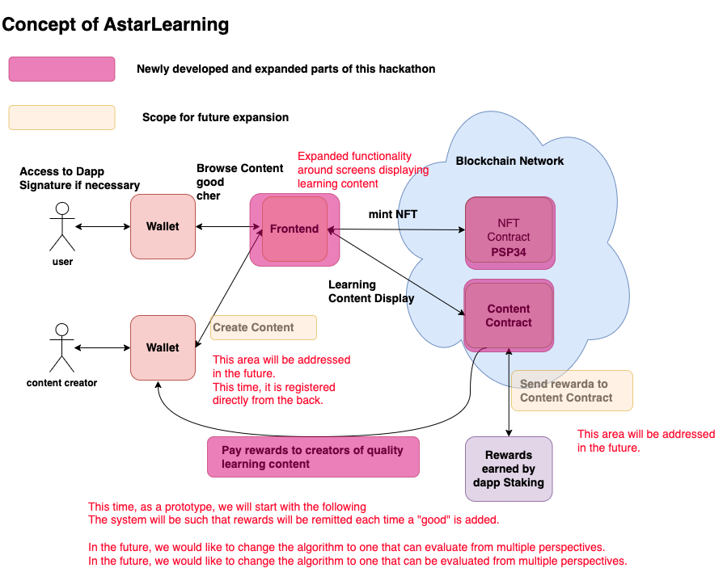

# Summary of Astar Learning

## Concept

## Problem to be solved & Solutions

- Problem to be solved

- Solutions

## TechStack

| No. | Name        | Purpose                                       |
| --- | ----------- | ------------------------------------------ |
| 1   | !ink        | Smart Contract Development Language               |
| 2   | Next.js     | Front-end development framework          |
| 3   | swanky      | Smart Contract Development Framework     |
| 4   | TypeScript  | Front-end Development Language                     |
| 5   | NFTStorage  | Metadata storage storage for NFT      |
| 6   | Tailwind CSS  | CSS framework for front-end      |
| 7   | Contract-UI | For deploying and validating smart contracts|
| 8   | MonoRepo | Improved development efficiency |

## Challenges we ran into

In addition to developing a WASM contract using `!ink`, we also developed a front-end program using Next.js+polkadot.js and connected them to develop a dapp that is comparable to using an EVM-compatible contract. 

 Also, for the first time, the team developed a dapp that supports WASM contracts. It was very difficult to set up the development environment for smart contracts.

## What we learned

We learned how to develop WASM contracts using `!ink`, `openbrush` and `contracts-ui`.  
In addition, there was much to learn about connecting with the front end, which was an issue, and we learned implementation patterns for connecting with WASM contracts using Next.js and Polkadot.js.

We had a hard time setting up the development environment for WASM contract development (Swanky version, rustup nightly settings, etc.), but we managed to set up a system that allowed us to develop as a team and develop MVP.

We would like to make use of this development experience as a foundation for future WASM development.

## Milestones

